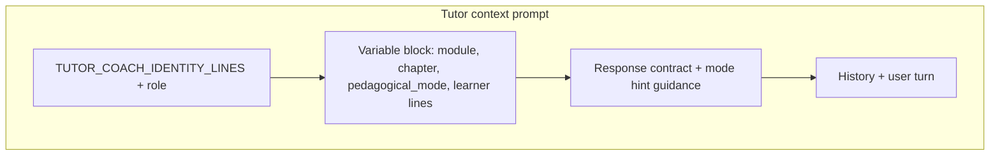
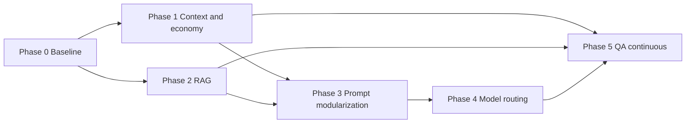

# LLM implementation roadmap

**Performance · Quality · Versatility · Economy**

This document is the **master implementation plan** for evolving how the app uses local LLMs (tutor, coach, RAG, generation, autopilot). It complements existing slices and developer notes:

| Document | Focus |
|----------|--------|
| [DEVELOPER_DOC.md](../DEVELOPER_DOC.md) | AI guardrails, 3Es prompts, architecture |
| [PROMPT_QUALITY_SLICE.md](../PROMPT_QUALITY_SLICE.md) | Prompt quality benchmarks and matrix |
| [PERFORMANCE_OPTIMIZATION_SLICE.md](../PERFORMANCE_OPTIMIZATION_SLICE.md) | Performance work already tracked |
| [RAG_AND_MODULE_IMPROVEMENTS.md](../RAG_AND_MODULE_IMPROVEMENTS.md) | RAG and module alignment |
| [LLM_OPERATIONS.md](LLM_OPERATIONS.md) | Budgets, routing JSON, env vars, QA commands, rollback |

**Audience**: maintainers implementing features. **Status**: roadmap (not a commitment to dates); ship behind flags until validated.

---

## 1. Goals and success metrics

### 1.1 Dimensions

| Dimension | Outcomes |
|-----------|----------|
| **Performance** | Lower p50/p90 turn latency; no UI stalls; predictable behavior under load. |
| **Quality** | Fewer off-syllabus answers; alignment with learner **activity** and **pedagogical mode**; grounded RAG when materials exist. |
| **Versatility** | New tutor/coach/generation behaviors via small, reviewable changes (presets, heads, contracts)—not copy-paste prompt growth. |
| **Economy** | Lower median tokens per turn and per session without measurable quality regression on the golden set. |

### 1.2 Guardrail

Every phase ships with **feature flags** or **defaults that preserve current behavior** until A/B or golden-set sign-off.

### 1.3 Metrics (instrumentation)

Collect per turn (or per job), at minimum:

- `purpose`: `tutor_turn` | `coach_turn` | `autopilot_decide` | `gap_gen` | `section_c` | `syllabus` | …
- `model_id`, `latency_ms`, outcome (`success` | `error` | `timeout` | `parse_retry`)
- `prompt_chars`, `context_chars`, `rag_chars`, `response_chars`, `tokens_est_in` / `tokens_est_out` (or proxy)
- Cache: `rag_doc_hit`, `rag_query_hit`, `context_format_hit` (boolean or count)
- **Effective learner topic** (or hash) at request time—for post-hoc analysis

**Exit criterion for Phase 0**: can answer “median tutor turn: X ms, Y est. tokens” and show cache hit rates for a typical session.

---

## 2. Architecture principles

1. **Contracts first** — Prompt shapes, JSON actions, and context packets are **versioned** (`AI_TUTOR_PROMPT_CONTRACT_VERSION` pattern). Breaking changes bump version and update tests.
2. **Single sources of truth** — Learner context flows from one place: e.g. effective activity topic (`_effective_tutor_topic` / successors), module id, syllabus scope string. Embedded tutor, pop-out, RAG, and autopilot must consume the same resolver—not divergent `current_topic` reads.
3. **Measure before/after** — No large prompt or budget change without golden-set and latency/token comparison.
4. **Deterministic guardrails** — Unchanged from DEVELOPER_DOC: validate JSON, timeouts, retries, fallbacks.

---

## 3. Phase 0 — Baseline and instrumentation

**Duration (indicative)**: 1–2 weeks  
**Purpose**: establish measurement before optimization.

### 3.1 Tasks

- [x] **P0.1** Unified schema: `docs/LLM_TELEMETRY_SCHEMA.md` + `studyplan/ai/llm_telemetry.py`; extended `_sanitize_ai_tutor_telemetry_event`.
- [x] **P0.2** Tutor embedded + pop-up log `purpose`, `effective_topic`, `module_id`, contract version, context fingerprint / omitted flag, plus existing metrics.
- [x] **P0.3** `scripts/llm_telemetry_aggregate.py` on `preferences.json` (or `STUDYPLAN_CONFIG_HOME`).
- [x] **P0.4** `tests/fixtures/golden_tutor_prompts.json` (30 prompts); `tests/test_golden_tutor_prompts.py`.
- [x] **P0.5** Fast checks: `pytest tests/test_golden_tutor_prompts.py tests/test_context_policy.py tests/test_assemble_tutor_prompt_dedup.py`; full suite in CI.

### 3.2 Deliverables

- [x] Telemetry spec: `docs/LLM_TELEMETRY_SCHEMA.md`.
- [x] Golden fixture + `tests/test_golden_tutor_prompts.py`.

### 3.3 Dependencies

- None (enables all later phases).

---

## 4. Phase 1 — Context policy and economy

**Duration**: 2–4 weeks  
**Purpose**: same or better answers with fewer tokens and less redundant computation.

### 4.1 Context packet policy engine

- [x] **P1.1** Roles in `studyplan/ai/context_policy.py` (`ROLE_*`, `map_packet_kind_to_role`).
- [x] **P1.2** **Drop order**: `CONTEXT_SECTION_DROP_ORDER` drives `_format_local_ai_context_block`. Char/token caps remain `_context_budget_limits` + `STUDYPLAN_AI_CONTEXT_MAX_*` env.
- [x] **P1.3** `tests/test_context_policy.py` + existing `test_format_local_ai_context_block_enforces_budget_and_degrade_order`.

**Primary touchpoints** (indicative): `studyplan_app.py` (`_build_local_ai_context_packet`, `_format_local_ai_context_block`), constants such as `AI_CONTEXT_*`.

### 4.2 Cache keys and invalidation

- [x] **P1.4** Formatted local-context cache key versioned (`local_context_block` payload `v: 2`). RAG keys: Phase 2.
- [x] **P1.5** Key includes `module_id`, packet `current_topic` (effective topic), `contract_v`, `role`, `budget`, stable packet JSON.
- [x] **P1.6** Doc note: any change to those fields or packet content invalidates the formatted-context cache entry.

### 4.3 De-duplicate static context across turns

- [x] **P1.7** `assemble_ai_tutor_turn_prompt` fingerprint line; embedded + pop-out compare sha256 of context block. `STUDYPLAN_TUTOR_CONTEXT_DEDUP=0` disables.
- [ ] **P1.8** Optional: golden multi-turn token regression.

### 4.4 Adaptive history summarization

- [x] **P1.9** `STUDYPLAN_DEVICE_TIER=low` + `STUDYPLAN_TUTOR_RECENT_CAP` via `adaptive_tutor_recent_cap` / `long_history_threshold_with_tier` in `build_ai_tutor_context_prompt_details`.
- [x] **P1.10** Caps documented in `context_policy.py` docstrings.

### 4.5 Deliverables

- [x] `studyplan/ai/context_policy.py`, `studyplan/ai/llm_telemetry.py`.
- [x] Operators run `scripts/llm_telemetry_aggregate.py` for before/after metrics.

---

## 5. Phase 2 — RAG: quality, performance, economy

**Duration**: 3–5 weeks  
**Purpose**: retrieval that is accurate, fast, and cheap.

### 5.1 Retrieval presets

- [x] **P2.1** Named presets: `tutor_explain`, `tutor_drill`, `coach`, `gap_gen` — each with `top_k`, `char_budget`, `min_score`, `neighbor_window`.
- [x] **P2.2** **Hard cap** on total RAG snippet chars per turn (in addition to dynamic scaling).
- [x] **P2.3** Wire preset selection from UI mode / job purpose.

**Primary touchpoints**: `_build_ai_tutor_rag_prompt_context`, env toggles, `studyplan_ai_tutor.py` call sites.

**Preset table** (`studyplan/ai/rag_presets.py`):

| Preset | Char budget (cap) | Neighbor | `min_score` | `top_k_max` cap | Max chunks / source | Hard char cap |
|--------|-------------------|----------|-------------|-----------------|---------------------|---------------|
| `tutor_explain` | env default | env | env | env | 2 | env `STUDYPLAN_AI_TUTOR_RAG_CHAR_HARD_CAP` (default 3600) |
| `tutor_drill` | 1300 | 0 | +0.02 | 9 | 1 | min(env, 2400) |
| `coach` | 1450 | 0 | — | 9 | 2 | min(env, 2600) |
| `gap_gen` | 1600 | 0 | +0.03 | 10 | 2 | min(env, 2800) |

Override preset: `STUDYPLAN_AI_TUTOR_RAG_PRESET`. Inference: `infer_tutor_rag_preset()` in `studyplan_ai_tutor.py` (embedded + pop-out tutor).

### 5.2 Citation discipline

- [x] **P2.4** System rule: when using RAG, tie factual claims to `[S#]`; if snippets insufficient, state that explicitly.
- [ ] **P2.5** Golden-set rubric: “unsupported specifics” count down.

### 5.3 Diversity vs volume

- [x] **P2.6** Enforce **cross-source diversity** before adding more chunks from the same PDF (tune existing diversification).
- [ ] **P2.7** Target: same relevance with lower `char_used` on benchmarks.

### 5.4 Parallelism and main-thread safety

- [ ] **P2.8** Parallelize independent doc loads / embedding where safe.
- [ ] **P2.9** Verify no GTK main-thread blocking on LLM/RAG paths.

### 5.5 Deliverables

- Preset table (doc + code).
- Before/after RAG stage latency (p90) on a multi-doc module.

**Module-scoped PDFs (Phase 3.9 overlap)**: `STUDYPLAN_AI_TUTOR_RAG_STRICT_MODULE_PDFS=1` filters loaded PDFs to `syllabus_meta.reference_pdfs` (when that list is non-empty).

---

## 6. Phase 3 — Prompt modularization and versatility

**Duration**: 3–6 weeks  
**Purpose**: safer evolution; clear behavior per task.

### 6.1 Layout

- [x] **P3.1** **Shared base**: role, safety, syllabus scope, output hygiene (single module or template).
- [ ] **P3.2** **Task heads**: short adapters per intent (`explain`, `apply`, `exam_technique`, `drill_author`, `coach_plan`, `autopilot_json`, …).
- [x] **P3.3** **Variable block**: learner state (activity topic, mode, optional competence line).

**Primary touchpoints**: `studyplan/ai/prompt_design.py`, `build_ai_tutor_context_prompt_details`, coach/autopilot builders.

Tutor **shared coach-identity block** lives in `studyplan/ai/tutor_prompt_layers.py` (`TUTOR_COACH_IDENTITY_LINES`); the full context prompt still assembles history and contracts in `build_ai_tutor_context_prompt_details`.

### 6.2 Pedagogical mode

- [x] **P3.4** Explicit `pedagogical_mode`: `explain` | `practice` | `exam_technique` | `revision` | `freeform`.
- [x] **P3.5** Derive from: concise/exam-only toggles, quick-prompt action type, optional autopilot hint.
- [ ] **P3.6** Golden-set: mode respected (e.g. exam technique requests don’t spawn long teaching monologues unless asked).

### 6.3 Structured outputs

- [ ] **P3.7** All machine-consumed outputs: JSON schema + validator + **one** relaxed retry (already partially aligned with 3Es).
- [ ] **P3.8** Metrics: parse failure rate down; no silent acceptance of invalid JSON.

### 6.4 Multi-module isolation

- [x] **P3.9** RAG and retrieval scoped to **current module** unless explicit user override (`STUDYPLAN_AI_TUTOR_RAG_STRICT_MODULE_PDFS=0` keeps legacy behavior).
- [x] **P3.10** Tests: wrong-module leakage absent.

### 6.5 Deliverables

**Contributor note**: Add reusable static prompt slices in `studyplan/ai/tutor_prompt_layers.py` (or `prompt_design.py` for non-tutor tasks). Register new **pedagogical** mappings in `derive_pedagogical_mode()`; add new **RAG** tuning in `studyplan/ai/rag_presets.py` and wire via `infer_tutor_rag_preset()` or env `STUDYPLAN_AI_TUTOR_RAG_PRESET`.

---

## 7. Phase 4 — Model routing and failover

**Duration**: 2–4 weeks  
**Purpose**: right model for the job; resilience under load.

### 7.1 Purpose-based selection

- [x] **P4.1** Config table: `purpose → primary_model → failover_chain` (extends existing failover builder). **Code**: `studyplan/ai/model_routing.py`, env `STUDYPLAN_LLM_MODEL_ROUTING_PATH` or `$CONFIG_HOME/llm_model_routing.json`; wired into `_resolve_local_llm_default_for_purpose` and `_build_local_llm_model_failover_sequence`.
- [x] **P4.2** Examples: `studyplan/ai/llm_model_routing.example.json` + [LLM_OPERATIONS.md](LLM_OPERATIONS.md) (map small/fast models to `coach` / `autopilot`, larger to `tutor` / generation purposes).

### 7.2 Optional auto-downgrade

- [x] **P4.3** If rolling p90 latency &gt; SLO or repeated timeouts: reduce context budget, enable concise mode, or swap to fast model. **Done**: context/RAG tightening via `_compute_ai_tutor_adaptive_limits`; optional **concise** tutor prompts via `STUDYPLAN_AI_TUTOR_AUTO_CONCISE_UNDER_LOAD=1`. Ranked auto-select already biases to faster models under load (`_select_local_llm_model`).
- [x] **P4.4** User-visible notice (once per session) + preference to disable. **Done**: status-line load notice from adaptive limits; suppress with `STUDYPLAN_AI_TUTOR_SUPPRESS_LOAD_NOTICE=1`.

### 7.3 Streaming

- [x] **P4.5** Default stream for tutor where supported; stall watchdog remains; cancel is clean. **Baseline**: embedded + pop-out tutor use `_ollama_generate_text_stream` with existing watchdog/cancel paths.

### 7.4 Deliverables

- [x] Config schema for routing (prefs or JSON). **Example**: `studyplan/ai/llm_model_routing.example.json`.
- [ ] Latency comparison: quick prompts on fast model vs baseline (benchmark notebook / ops runbook — optional follow-up).

---

## 8. Phase 5 — Quality assurance (continuous)

**Start**: after Phase 0; **intensify** after Phases 1–2.

### 8.1 Regression suite

- [x] **P5.1** Expand tutor quality runner: syllabus scope, exam focus, actionability, RAG citation when snippets present. **Done**: `quality_scorer.py` supports `expected.quality_checks.require_rag_style_citation`; matrix case `f9_quality_rag_citation`; broader syllabus-scope rubric can extend the same `quality_checks` pattern.
- [x] **P5.2** CI: subset on every PR; full suite nightly. **Done**: PR CI runs full `pytest` (includes `tests/tutor_quality/`). Optional dedicated Ollama/nightly job remains future work.

### 8.2 Shadow / A/B (optional)

- [x] **P5.3** Candidate preset/prompt runs in shadow; compare rubric scores and tokens without changing user-visible output. **Tool**: `tools/run_tutor_quality_shadow_compare.py` (two `case_id → response` JSON maps vs one matrix). Token deltas: compare telemetry or prompt logs from offline runs.

### 8.3 Operations handbook

- [x] **P5.4** Single **LLM operations** page: budgets, cache keys, contract versions, rollback steps, env vars. **Doc**: [LLM_OPERATIONS.md](LLM_OPERATIONS.md).

---

## 9. Dependency graph

- **Parallel**: P1 and P2 after P0.
- **P3** after P1+P2 stabilizes packets and RAG (avoid modularizing a moving target).
- **P4** after P3 so routing targets stable prompt shapes.

---

## 10. Risk register

| Risk | Mitigation |
|------|------------|
| Quality regression | Golden set + CI; feature flags; revert presets |
| Stale cache / wrong context | Strong invalidation; include doc/content hashes |
| Prompt sprawl | Enforce base + head layout; review checklist |
| User confusion (auto-downgrade) | Clear status copy; opt-out in preferences |
| Over-optimization on one model | Test matrix: small + large local models |

---

## 11. Indicative timeline (single maintainer)

| Phase | Weeks (calendar, rough) |
|-------|-------------------------|
| 0 | 1–2 |
| 1 | 2–4 |
| 2 | 3–5 |
| 3 | 3–6 |
| 4 | 2–4 |
| 5 | Continuous from ~week 3 |

Adding a second implementer: parallelize P1 and P2; resolve prompt conflicts via Phase 3 structure early (stub `heads/` and registry).

---

## 12. Completion checklist (program level)

- [ ] Phase 0 telemetry live + golden set committed
- [ ] Phase 1 role-based context policy + cache audit done
- [ ] Phase 2 RAG presets + citation rules + char cap
- [ ] Phase 3 modular prompts + pedagogical mode
- [x] Phase 4 purpose-based routing documented and tested
- [x] Phase 5 CI quality gate + ops doc

---

## 13. Revision history

| Date | Change |
|------|--------|
| 2026-03-21 | Initial roadmap document created from consolidated improvement plan. |
| 2026-03-21 | Phases 0–1 initial implementation (telemetry schema, golden prompts, context policy, cache key v2, context dedup, adaptive history). |
| 2026-03-21 | Phases 4–5 baseline: `model_routing.json` integration, auto-concise + load notice envs, tutor quality RAG citation check, `docs/LLM_OPERATIONS.md`. |

When phases complete, append rows here with link to PR or release tag.
